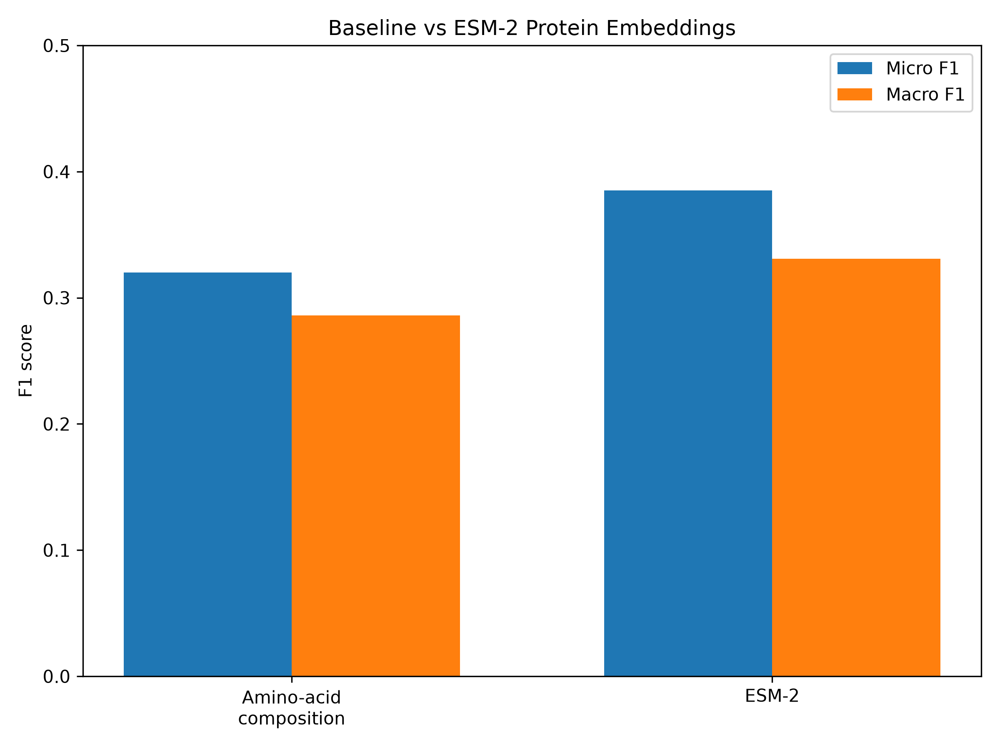
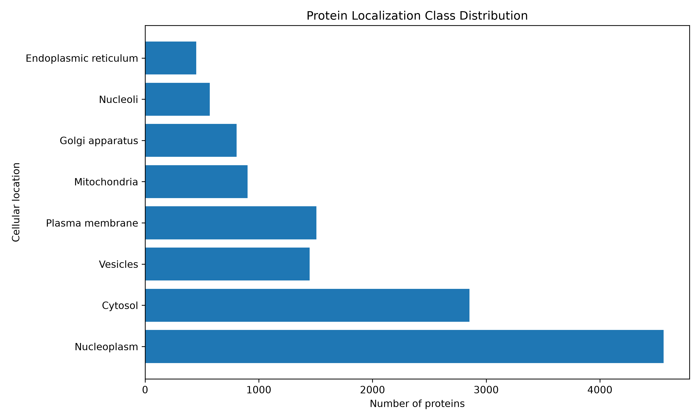
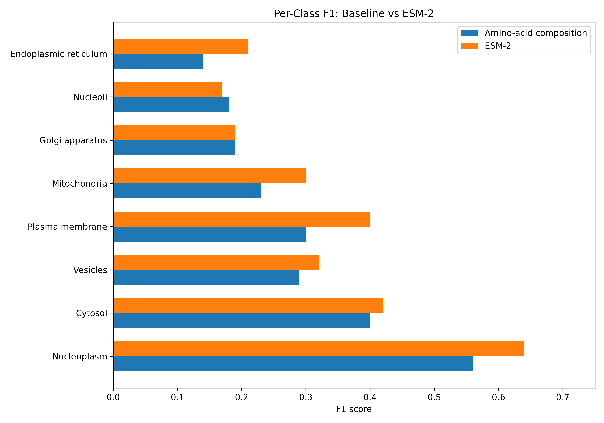

# Protein Subcellular Localization with Machine Learning

This project predicts **where a human protein is likely to be located inside a cell based on its amino-acid sequence**.

Proteins perform different jobs depending partly on where they are located. For example, some proteins primarily function in the nucleus, some in mitochondria, and others at the plasma membrane.

The goal of this project is to investigate whether machine-learning models can learn this relationship directly from protein sequences.

The project compares three increasingly sophisticated approaches:

1. **A simple baseline** using amino-acid composition.
2. **A pretrained protein language model, ESM-2**, which converts protein sequences into learned numerical representations.
3. **A neural network** trained on those ESM-2 representations.

The final model also uses **class-specific decision thresholds**, selected using validation data, to improve predictions for cellular locations that occur at very different frequencies.

---

## Project Overview

At a high level, the project works like this:

```text
Human Protein Atlas
        |
        | cellular-location labels
        v
Protein labels
        |
        | matched by gene name
        v
UniProt protein sequences
        |
        v
Sequence + known cellular location
        |
        +------------------------------+
        |                              |
        v                              v
Amino-acid composition            ESM-2 embeddings
20 simple features                320 learned features
        |                              |
        v                              v
Logistic regression       Logistic regression / Neural network
        |                              |
        +---------------+--------------+
                        |
                        v
              Localization predictions
                        |
                        v
              Model evaluation using F1
```

The central question is:

> Does a pretrained protein language model capture useful biological information that simple sequence statistics miss?

The results suggest that it does.

---

## Final Results

The models were evaluated on a held-out test set of **2,193 proteins**.

| Model | Micro F1 | Macro F1 |
|---|---:|---:|
| Amino-acid composition + Logistic Regression | 0.320 | 0.286 |
| ESM-2 embeddings + Logistic Regression | 0.385 | 0.331 |
| ESM-2 embeddings + Neural Network | 0.401 | 0.356 |
| **ESM-2 + Neural Network + Tuned Thresholds** | **0.484** | **0.415** |

The final model improved Micro F1 from **0.320 to 0.484**, approximately a **51% relative improvement** over the original baseline.

It also improved Macro F1 from **0.286 to 0.415**, showing better performance across both common and uncommon localization classes.



---

# What Is Protein Localization?

A protein is built from a sequence of amino acids.

A simplified example might look like:

```text
MKWVTFISLLFLFSSAYSRGVFRR
```

The letters represent different amino acids.

However, proteins do not all operate in the same place.

Examples of cellular locations include:

- Nucleoplasm
- Cytosol
- Mitochondria
- Plasma membrane
- Endoplasmic reticulum
- Golgi apparatus

The amino-acid sequence contains signals related to protein structure, transport, and cellular function.

This project asks whether machine-learning models can detect some of those signals.

---

# The Prediction Task

This project predicts eight cellular locations:

1. Nucleoplasm
2. Cytosol
3. Vesicles
4. Plasma membrane
5. Mitochondria
6. Golgi apparatus
7. Nucleoli
8. Endoplasmic reticulum

This is a **multi-label classification problem**.

That means one protein can belong to more than one location.

For example, a protein could have labels such as:

```text
Nucleoplasm = 1
Cytosol = 1
Mitochondria = 0
Plasma membrane = 0
...
```

This differs from ordinary classification, where every example must belong to exactly one class.

---

# Data Sources

Two biological data sources are combined.

## Human Protein Atlas

The Human Protein Atlas provides experimentally derived information about where human proteins are found inside cells.

The raw subcellular-location dataset contained:

```text
13,603 genes
49 possible main cellular locations
```

Annotations also include reliability levels:

- Enhanced
- Supported
- Approved
- Uncertain

For this project, annotations marked **Uncertain** were excluded.

To keep the first version of the project manageable and ensure enough examples per class, the eight most useful well-populated locations were selected.

After filtering:

```text
11,261 genes remained in the label dataset
```

---

## UniProt

The Human Protein Atlas provides localization labels, but the machine-learning models also need the actual amino-acid sequence for each protein.

Reviewed human protein sequences were therefore downloaded from UniProt.

The downloaded UniProt dataset contained:

```text
20,431 reviewed human protein entries
```

The datasets were joined using standardized gene names.

Final matching result:

```text
Labelled genes:        11,261
Matched proteins:      10,962
Match rate:             97.3%
```

The resulting modeling dataset therefore contains **10,962 proteins with both sequences and localization labels**.

---

# Class Distribution

The target classes are imbalanced.

Some locations occur much more frequently than others.

For example:

```text
Nucleoplasm               4694
Cytosol                   2922
Plasma membrane           1541
Vesicles                  1479
Mitochondria               926
Golgi apparatus            822
Nucleoli                    589
Endoplasmic reticulum       469
```

This imbalance is important because a model could otherwise become biased toward the most common locations.



---

# Model 1: Amino-Acid Composition Baseline

The first model intentionally uses a very simple representation.

For every protein, the fraction of each of the 20 standard amino acids is calculated.

For example:

```text
Protein sequence
      |
      v
Count amino acids
      |
      v
20 numerical features

A = 0.042
C = 0.000
D = 0.000
...
W = 0.042
Y = 0.042
```

These features tell the model **what amino acids are present**, but not their order.

That means these two sequences could have identical composition:

```text
AAACCCGGG
GGGCCCAAA
```

even though their ordering is completely different.

A separate logistic-regression classifier is trained for each cellular location using a One-vs-Rest strategy.

The baseline produced:

```text
Micro F1: 0.320
Macro F1: 0.286
```

This establishes a reference point for evaluating more sophisticated representations.

---

# Model 2: ESM-2 Protein Embeddings

The second approach uses **ESM-2**, a pretrained protein language model.

A protein language model works somewhat like a language model for human text.

A text model can learn relationships between words from very large amounts of text.

Similarly, ESM-2 was trained on large numbers of protein sequences and learned patterns in amino-acid sequences.

Instead of manually designing 20 features, ESM-2 converts every protein into a learned numerical representation.

In this project:

```text
Protein sequence
      |
      v
Pretrained ESM-2
      |
      v
320-dimensional embedding
```

For example:

```text
MKWVTFISLLFLFSSAY...
        |
        v
[0.18, -0.42, 0.05, ..., 0.31]
```

Each protein becomes a vector containing **320 learned features**.

The project uses:

```text
facebook/esm2_t6_8M_UR50D
```

This is the relatively small 8-million-parameter ESM-2 model, which allows the embeddings to be generated on a CPU.

The complete dataset produced an embedding matrix with shape:

```text
(10962, 320)
```

meaning:

```text
10,962 proteins
×
320 learned features per protein
```

---

# Model 3: Logistic Regression on ESM-2

To test whether the ESM-2 representations contain useful biological information, logistic regression was first trained directly on the embeddings.

Results:

```text
Micro F1: 0.385
Macro F1: 0.331
```

This already outperformed the amino-acid composition baseline.

That suggests the pretrained protein model captures sequence information that simple amino-acid frequencies do not.



---

# Model 4: Neural Network on ESM-2

The next model adds nonlinear learning on top of the ESM-2 embeddings.

Architecture:

```text
320 ESM features
      |
      v
128 hidden units
ReLU
Dropout
      |
      v
64 hidden units
ReLU
Dropout
      |
      v
8 outputs
```

The eight outputs represent the eight possible cellular locations.

Because this is multi-label classification, the final layer uses independent probabilities rather than forcing the probabilities to add up to one.

Training uses:

- Binary cross-entropy loss
- Class weighting
- Adam optimizer
- Validation data
- Early stopping
- Dropout regularization

The neural network achieved:

```text
Micro F1: 0.401
Macro F1: 0.356
```

This improved further over logistic regression.

---

# Class Imbalance

The classes in the dataset are not equally common.

For example, there are thousands of nucleoplasm proteins but fewer than 500 endoplasmic-reticulum proteins in the selected dataset.

To help the model learn rarer classes, positive examples are given greater weight during neural-network training.

Without this adjustment, the model could obtain deceptively good overall performance simply by focusing on common locations.

---

# Threshold Tuning

By default, multi-label models often classify an output as positive when:

```text
predicted probability >= 0.50
```

However, the same threshold is not necessarily optimal for every cellular location.

For example, the model may behave differently for:

```text
Nucleoplasm
```

than for:

```text
Nucleoli
```

because the two classes have different frequencies and prediction characteristics.

Thresholds were therefore optimized **using the validation set only**.

The final thresholds were:

| Cellular location | Threshold |
|---|---:|
| Nucleoplasm | 0.36 |
| Cytosol | 0.46 |
| Vesicles | 0.58 |
| Plasma membrane | 0.63 |
| Mitochondria | 0.72 |
| Golgi apparatus | 0.65 |
| Nucleoli | 0.78 |
| Endoplasmic reticulum | 0.76 |

The test set was not used to select these values.

After the thresholds were selected using validation data, the final model was evaluated on the untouched test set.

Results:

```text
Micro F1: 0.484
Macro F1: 0.415
```

This was the best-performing model in the project.

---

# Why Use Separate Training, Validation, and Test Sets?

The data is split into three groups.

```text
Training set
    |
    | model learns parameters
    v

Validation set
    |
    | choose model settings
    | choose thresholds
    v

Test set
    |
    | final unbiased evaluation
    v
Final results
```

The test set must remain untouched while the model is being designed.

Otherwise, decisions could accidentally be made that specifically improve performance on the test set rather than on new unseen proteins.

For this project:

```text
Training proteins:      7,453
Validation proteins:    1,316
Testing proteins:       2,193
```

---

# Understanding the Evaluation Metrics

## Precision

Precision asks:

> When the model predicts a cellular location, how often is it correct?

High precision means relatively few false-positive predictions.

---

## Recall

Recall asks:

> Of the proteins that actually belong to a location, how many did the model find?

High recall means relatively few positive proteins are missed.

---

## F1 Score

F1 combines precision and recall into one metric.

A model must perform reasonably well on both to obtain a strong F1 score.

---

## Micro F1

Micro F1 combines predictions across all proteins and classes before calculating the score.

It is influenced more heavily by common classes.

---

## Macro F1

Macro F1 calculates an F1 score separately for every class and then averages them.

Each cellular location therefore receives equal importance.

This makes Macro F1 particularly useful when classes are imbalanced.

---

# Final Per-Class Performance

Using the tuned neural-network model:

| Location | Precision | Recall | F1 |
|---|---:|---:|---:|
| Nucleoplasm | 0.54 | 0.84 | 0.66 |
| Cytosol | 0.33 | 0.67 | 0.44 |
| Vesicles | 0.25 | 0.50 | 0.33 |
| Plasma membrane | 0.35 | 0.55 | 0.43 |
| Mitochondria | 0.44 | 0.61 | 0.51 |
| Golgi apparatus | 0.19 | 0.36 | 0.25 |
| Nucleoli | 0.46 | 0.25 | 0.33 |
| Endoplasmic reticulum | 0.32 | 0.43 | 0.37 |

The model performs best on some biologically distinctive or better-represented classes, while others remain more difficult.

---

# Repository Structure

```text
protein-localization-ml/
│
├── data/
│   ├── raw/
│   ├── processed/
│   └── README.md
│
├── figures/
│   ├── baseline_f1_scores.png
│   ├── class_distribution.png
│   ├── model_comparison.png
│   ├── per_class_model_comparison.png
│   └── README.md
│
├── models/
│   ├── tuned_thresholds.json
│   └── README.md
│
├── notebooks/
│   └── README.md
│
├── src/
│   ├── __init__.py
│   ├── features.py
│   ├── inspect_data.py
│   ├── analyze_labels.py
│   ├── preprocess_labels.py
│   ├── download_sequences.py
│   ├── merge_sequences.py
│   ├── train_baseline.py
│   ├── plot_baseline.py
│   ├── generate_esm_embeddings.py
│   ├── train_esm_classifier.py
│   ├── train_neural_network.py
│   ├── train_neural_network_tuned.py
│   └── plot_model_comparison.py
│
├── .gitignore
├── LICENSE
├── README.md
└── requirements.txt
```

---

# What Each Script Does

### `features.py`

Converts a protein sequence into amino-acid composition features.

---

### `inspect_data.py`

Loads the Human Protein Atlas dataset and displays its columns, size, example rows, and missing values.

---

### `analyze_labels.py`

Examines the distribution of cellular-location labels.

---

### `preprocess_labels.py`

Cleans the Human Protein Atlas annotations, removes uncertain examples, selects the eight target locations, and creates binary target columns.

---

### `download_sequences.py`

Downloads reviewed human protein sequences from UniProt.

---

### `merge_sequences.py`

Matches Human Protein Atlas genes to UniProt amino-acid sequences.

---

### `train_baseline.py`

Trains the amino-acid-composition logistic-regression baseline.

---

### `plot_baseline.py`

Creates the initial class-distribution and baseline-performance figures.

---

### `generate_esm_embeddings.py`

Uses pretrained ESM-2 to convert every protein sequence into a 320-dimensional embedding.

---

### `train_esm_classifier.py`

Trains logistic regression using the ESM-2 embeddings.

---

### `train_neural_network.py`

Trains a small neural network on the ESM-2 embeddings.

---

### `train_neural_network_tuned.py`

Trains the neural network, selects class-specific thresholds using validation data, and performs the final test evaluation.

---

### `plot_model_comparison.py`

Creates figures comparing the different modeling approaches.

---

# Running the Project

## 1. Create a Python environment

A virtual environment is recommended so the project's Python packages do not interfere with packages used by other projects.

---

## 2. Install the dependencies

From the project directory:

```bash
python -m pip install -r requirements.txt
```

---

## 3. Obtain the Human Protein Atlas localization data

Place the Human Protein Atlas subcellular-location TSV file in:

```text
data/raw/subcellular_location.tsv
```

Raw datasets are intentionally not committed to GitHub.

---

## 4. Inspect and preprocess the localization labels

```bash
python src/inspect_data.py
python src/analyze_labels.py
python src/preprocess_labels.py
```

---

## 5. Download protein sequences

```bash
python src/download_sequences.py
```

---

## 6. Match protein sequences to labels

```bash
python src/merge_sequences.py
```

---

## 7. Train the simple baseline

```bash
python src/train_baseline.py
```

---

## 8. Generate ESM-2 embeddings

A quick test can be run first:

```bash
python src/generate_esm_embeddings.py --limit 25
```

To generate embeddings for the full dataset:

```bash
python src/generate_esm_embeddings.py
```

This step is the most computationally expensive part of the project.

On the development machine used for this project, processing all 10,962 proteins with the small ESM-2 model on CPU took approximately 10 minutes.

---

## 9. Train the ESM logistic-regression model

```bash
python src/train_esm_classifier.py
```

---

## 10. Train the neural network

```bash
python src/train_neural_network.py
```

---

## 11. Train and evaluate the final threshold-tuned model

```bash
python src/train_neural_network_tuned.py
```

---

## 12. Generate result figures

```bash
python src/plot_baseline.py
python src/plot_model_comparison.py
```

---

# Why Large Data Files Are Not Stored in GitHub

The following directories are excluded using `.gitignore`:

```text
data/raw/
data/processed/
```

This prevents large biological datasets and generated ESM embeddings from being committed directly to the repository.

Instead, the repository contains scripts that reproduce the data-processing pipeline.

Large trained-model files are also excluded.

Small configuration files such as:

```text
models/tuned_thresholds.json
```

are retained because they are useful for reproducing the final prediction behavior.

---

# Limitations

This project is intended as a machine-learning and computational-biology project rather than a production biological prediction system.

Several limitations remain.

### Sequence truncation

ESM-2 has a sequence-length limit.

For proteins longer than 1,022 residues, this project retains sequence information from both the beginning and end of the protein.

Information in the middle of extremely long proteins is therefore not represented.

### Gene-name matching

Human Protein Atlas and UniProt records were matched using standardized primary gene names.

Approximately 2.7% of labelled genes did not find a corresponding reviewed UniProt protein using this approach.

A more advanced pipeline could use stable cross-database identifiers instead.

### Limited target locations

The original dataset contains 49 main cellular locations.

This project predicts only eight relatively well-populated classes.

Expanding to more classes would make the problem more biologically complete but also more difficult.

### Simple classifier architecture

The neural network operates on fixed pretrained ESM embeddings.

The ESM model itself is not fine-tuned.

Fine-tuning a larger protein language model could potentially improve performance, but would require substantially more computational resources.

### Random train/test splitting

Proteins with related sequences may appear across different splits.

A stricter biological benchmark could cluster proteins by sequence similarity and ensure related proteins remain within the same split.

That would provide a harder test of generalization to genuinely novel protein families.

---

# Possible Future Improvements

Potential extensions include:

- Sequence-similarity-aware train/test splitting
- Larger ESM-2 models
- Fine-tuning the protein language model
- More cellular-location classes
- Additional sequence-derived biological features
- Better hyperparameter optimization
- Precision-recall curve analysis
- Calibration analysis
- Model interpretability
- Predicting locations for user-provided sequences
- A small web interface for interactive predictions

---

# Key Takeaways

This project demonstrates several important machine-learning concepts in a biological setting:

- Real-world biological data preprocessing
- Joining datasets from different scientific resources
- Multi-label classification
- Class imbalance
- Logistic regression
- Neural networks
- Pretrained protein language models
- Transfer learning
- Train/validation/test separation
- Early stopping
- Threshold optimization
- Precision, recall, Micro F1, and Macro F1
- Reproducible data-processing pipelines
- Scientific comparison between simple and advanced models

Most importantly, the experiments show a clear progression:

```text
Simple sequence statistics
Micro F1 = 0.320
        |
        v
Pretrained protein representations
Micro F1 = 0.385
        |
        v
Neural network
Micro F1 = 0.401
        |
        v
Validation-tuned decision thresholds
Micro F1 = 0.484
```

The project therefore provides evidence that pretrained protein language models contain useful biological information for predicting protein subcellular localization.

---

## Project Status

**Core project complete.**

The current best model is:

```text
ESM-2 embeddings
+
Neural network
+
Validation-tuned class-specific thresholds
```

Final held-out test performance:

```text
Micro F1: 0.484
Macro F1: 0.415
```